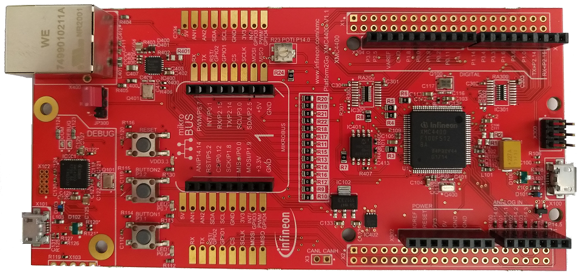

# KIT_XMC_PLT2GO_XMC4400 BSP

## Overview

Kit Platform2GO XTREME XMC4400 kit - This kit has the XMC4400 device with debugger plus ETHERNET, CAN, ARDUINO, MikroBUS and Shields2Go form factor. Equipped with an ARM® Cortex®-M4 based XMC™ Microcontroller from Infineon Technologies AG, the XMC4400 Platform2Go is designed to evaluate the capabilities of Infineon's XMC4400 Microcontroller.     
**Note:**
Programming this kit requires installing 
[SEGGER J-Link software](https://www.segger.com/downloads/jlink/#J-LinkSoftwareAndDocumentationPack)

To use code from the BSP, simply include a reference to `cybsp.h`.

## Features

### Kit Features:

* XMC4400 (ARM® Cortex®-M4 based) Microcontroller
* On-board Debug Probe with USB interface supporting SWD + SWO
* Detachable J-Link debugger and UART virtual COM port, with micro USB connector
* Virtual COM Port via Debug Probe
* Arduino Uno compatibility
* Shields2Go connectivity
* Ethernet-enabled communication option
* Additional voltage level shifters
* Available in four different assembly versions: 3.3V Shields (Lite), 5V (Lite)
* CAN connectivity

### Kit Contents:

* KIT_XMC_PLT2GO_XMC4400 evaluation board

## BSP Configuration

The BSP has a few hooks that allow its behavior to be configured. Some of these items are enabled by default while others must be explicitly enabled. Items enabled by default are specified in the KIT_XMC_PLT2GO_XMC4400.mk file. The items that are enabled can be changed by creating a custom BSP or by editing the application makefile.

Components:
* Device specific category reference (e.g.: CAT1) - This component, enabled by default, pulls in any device specific code for this board.

Defines:
* CYBSP_WIFI_CAPABLE - This define, disabled by default, causes the BSP to initialize the interface to an onboard wireless chip if it has one.
* CY_USING_HAL - This define, enabled by default, specifies that the HAL is intended to be used by the application. This will cause the BSP to include the applicable header file and to initialize the system level drivers.
* CYBSP_CUSTOM_SYSCLK_PM_CALLBACK - This define, disabled by default, causes the BSP to skip registering its default SysClk Power Management callback, if any, and instead to invoke the application-defined function `cybsp_register_custom_sysclk_pm_callback` to register an application-specific callback.

See the [BSP Setttings][settings] for additional board specific configuration settings.

## API Reference Manual

The KIT_XMC_PLT2GO_XMC4400 Board Support Package provides a set of APIs to configure, initialize and use the board resources.

See the [BSP API Reference Manual][api] for the complete list of the provided interfaces.

## More information
* [KIT_XMC_PLT2GO_XMC4400 BSP API Reference Manual][api]
* [KIT_XMC_PLT2GO_XMC4400 Documentation](https://www.infineon.com/cms/en/product/evaluation-boards/kit_xmc_plt2go_xmc4400/)
* [Cypress Semiconductor, an Infineon Technologies Company](http://www.cypress.com)
* [Infineon GitHub](https://github.com/infineon)
* [ModusToolbox™](https://www.cypress.com/products/modustoolbox-software-environment)

[api]: https://infineon.github.io/TARGET_KIT_XMC_PLT2GO_XMC4400/html/modules.html
[settings]: https://infineon.github.io/TARGET_KIT_XMC_PLT2GO_XMC4400/html/md_bsp_settings.html

---
© Cypress Semiconductor Corporation (an Infineon company) or an affiliate of Cypress Semiconductor Corporation, 2019-2022.